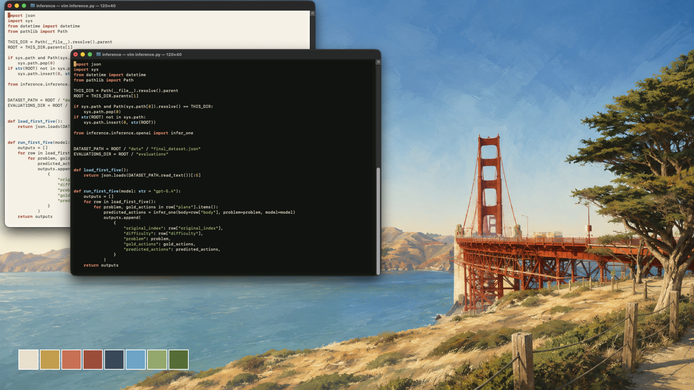
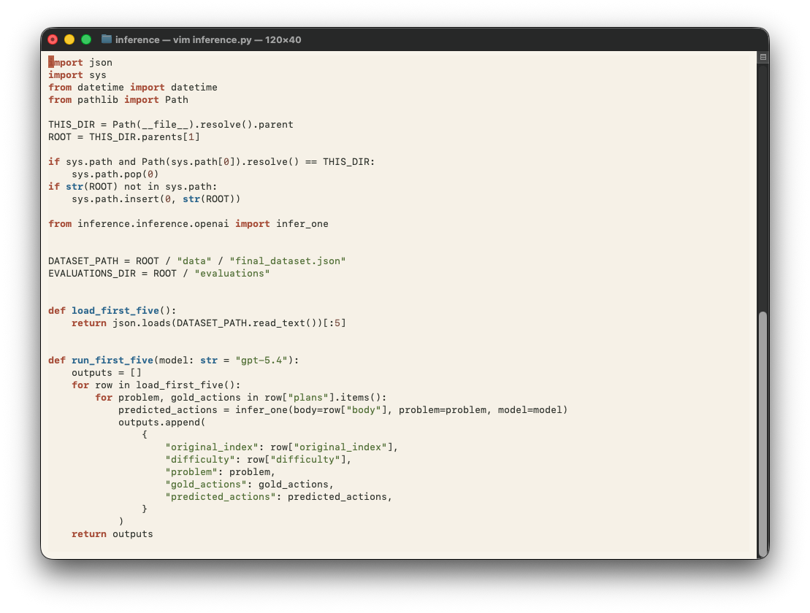
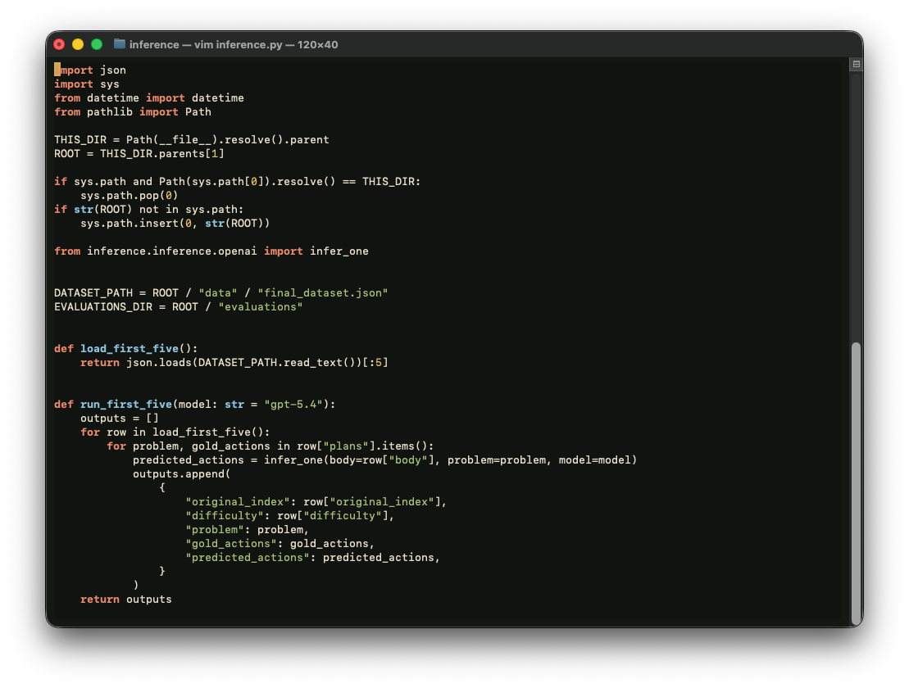
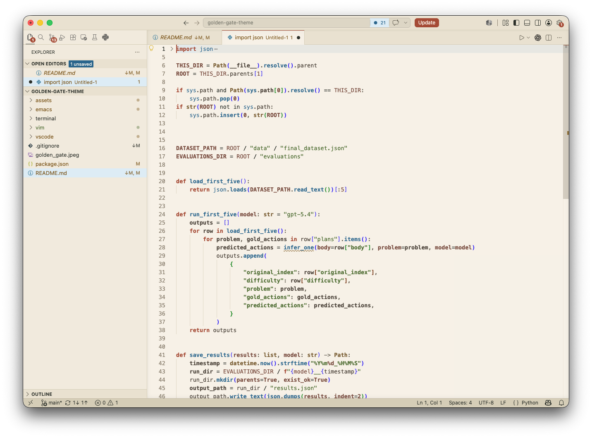
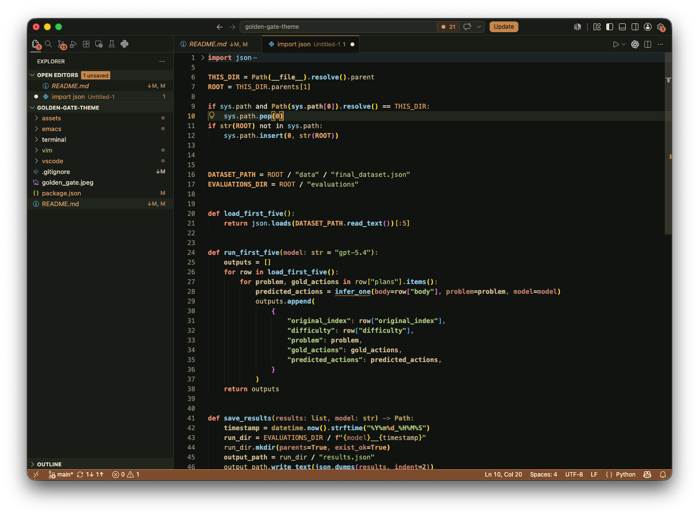

# Golden Gate Themes (🌁 & 🌉)



Warm light and dark editor themes inspired by a photo I took of the 🌉: bridge rust, bay blue, cypress green, cliff taupe, dry coastal sand, and a dark copper accent.


## Set up
- [macOS Terminal](#macos-terminal)
- [VS Code](#vs-code)
- [Vim / Neovim](#vim--neovim)
- [Emacs](#emacs)
- [Palettes](#palettes)


## macOS Terminal

Import `terminal/Golden Gate Light.terminal` or `terminal/Golden Gate Dark.terminal` from Terminal.app:

1. Open Terminal settings.
2. Choose Profiles.
3. Use the gear menu to import the profile.
4. Select the imported profile, then make it the default if desired.

**Light**



**Dark**



## VS Code

The VS Code themes live in `vscode/` and are contributed by the root `package.json`.

To use the themes directly in your normal VS Code install, symlink the repository into your extensions folder and reload VS Code:

```sh
mkdir -p ~/.vscode/extensions
ln -s /path/to/golden-gate-theme ~/.vscode/extensions/golden-gate-theme
```

Then run `Preferences: Color Theme` and choose `Golden Gate Light` or `Golden Gate Dark`.

The VS Code palettes use the existing Vim and Emacs themes as the source of truth, with a few editor-specific decisions:

- Neutral sand/charcoal ramps carry the workbench chrome, sidebars, panels, tabs, widgets, and editor background.
- Bridge rust marks keywords, destructive states, errors, active badges, and debugging state.
- Bay blue carries light-theme focus, links, functions, info, selections, and no-folder status.
- Cypress green carries strings, success, additions, and untracked resources.
- Earth/copper carries warnings, search, changed resources, constants, and the dark-theme focus/status accent.

**Light**



**Dark**



## Vim / Neovim

The Vim theme files live under `vim/colors/` to mirror Vim's runtime layout.

Copy or symlink the Vim colorschemes into a Vim runtime path:

```sh
mkdir -p ~/.vim/colors
ln -s /path/to/golden-gate-theme/vim/colors/golden-gate-light.vim ~/.vim/colors/golden-gate-light.vim
ln -s /path/to/golden-gate-theme/vim/colors/golden-gate-dark.vim ~/.vim/colors/golden-gate-dark.vim
```

Then load the light variant:

```vim
set background=light
colorscheme golden-gate-light
```

Or the dark variant:

```vim
set background=dark
colorscheme golden-gate-dark
```

For Neovim, use `~/.config/nvim/colors/` instead.

## Emacs

Clone this repository, then add it to `custom-theme-load-path`:

```elisp
(add-to-list 'custom-theme-load-path "/path/to/golden-gate-theme")
(load-theme 'golden-gate-light t)
```

For the dark variant:

```elisp
(load-theme 'golden-gate-dark t)
```
## Palettes
### 🌁 Light Palette

| Role | Color |
| --- | --- |
| Background | `#f7f1e6` |
| Foreground | `#2b2f29` |
| Bridge rust | `#a84732` |
| Bay blue | `#1e668e` |
| Cypress green | `#4f6d2f` |
| Cliff taupe | `#7a5b2e` |
| Sand surface | `#eae0cf` |
| Region blue | `#cfe1ee` |

### 🌉 Dark Palette

| Role | Color |
| --- | --- |
| Background | `#10130f` |
| Foreground | `#eadfca` |
| Copper ochre | `#c98243` |
| Bright copper | `#e19a5e` |
| Bridge rust | `#d66a4d` |
| Bay blue | `#5ca7c9` |
| Cypress green | `#8fa866` |
| Selection blue | `#33495a` |
